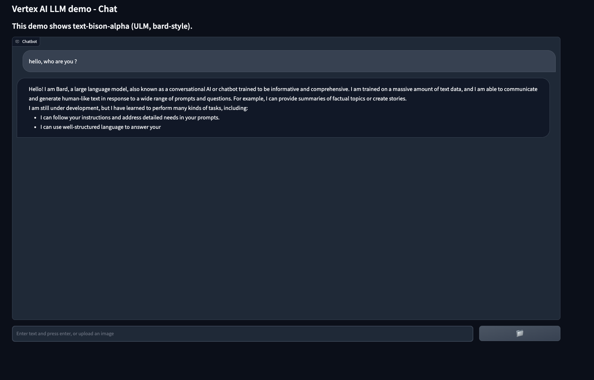

# Chatbot with PaLM-2 in Vertex AI

The repo includes a basic example of a chatbot in [Gradio](https://gradio.app/) to show the capabilities of a PaLM-2 model, `chat-bison@001`, deployed in Vertex AI.



## PaLM-2 in Vertex AI

PaLM-2 for Chat is one of the foundational models available in Vertex AI. PaLM-2 technical erport can be found [here](https://ai.google/static/documents/palm2techreport.pdf). Using the Vertex AI SDK, you can easily call a prediction with the following:

```py
vertexai.init(project=PROJECT_ID, location=LOCATION)
chat_model = ChatModel.from_pretrained("chat-bison@001")
chat_model.predict(
    prompt,
    max_output_tokens=max_output_tokens, # default 128
    temperature=temperature, # default 0
    top_p=top_p, # default 1
    top_k=top_k) # default 40
```


## User managed service account for Cloud Run

Since the application is deployed in Cloud Run, it uses the permissions of the compute service account by default. It's recommended to use a separate service account for minimum permissions. To do that, [create the service account with impersonation](https://cloud.google.com/run/docs/securing/service-identity) and the following two extra roles: `roles/aiplatform.user` to be able to call predictions and `roles/logging.logWriter` to be able to write logs.

```sh
# Create service account
gcloud iam service-accounts create cloud-run-llm \
    --description="Service account to call LLM models from Cloud Run" \
    --display-name="cloud-run-llm"

# add aiplatform.user role
gcloud projects add-iam-policy-binding argolis-rafaelsanchez-ml-dev \
    --member="serviceAccount:cloud-run-llm@argolis-rafaelsanchez-ml-dev.iam.gserviceaccount.com" \
    --role="roles/aiplatform.user"

# add logging.logWriter role
gcloud projects add-iam-policy-binding argolis-rafaelsanchez-ml-dev \
    --member="serviceAccount:cloud-run-llm@argolis-rafaelsanchez-ml-dev.iam.gserviceaccount.com" \
    --role="roles/logging.logWriter"

# add permission to impersonate the sa (iam.serviceAccounts.actAs), since this is a user-namaged sa
gcloud iam service-accounts add-iam-policy-binding \
    cloud-run-llm@argolis-rafaelsanchez-ml-dev.iam.gserviceaccount.com \
    --member="user:<REPLACE_WITH_YOUR_USER_ACCOUNT>" \
    --role="roles/iam.serviceAccountUser"
```


## Build and deploy in Cloud Run

To build and deploy the [Gradio app](https://gradio.app/) in [Cloud Run](https://cloud.google.com/run/docs/quickstarts/deploy-container), you need to build the docker in Artifact Registry and deploy it in Cloud Run.

Note authentication is disabled and the service account in the one configured earlier:

```sh
gcloud auth configure-docker europe-west4-docker.pkg.dev
gcloud builds submit --tag europe-west4-docker.pkg.dev/argolis-rafaelsanchez-ml-dev/ml-pipelines-repo/genai-chat-demo
gcloud run deploy genai-chat-demo --port 7860 --image europe-west4-docker.pkg.dev/argolis-rafaelsanchez-ml-dev/ml-pipelines-repo/genai-chat-demo --service-account=cloud-run-llm@argolis-rafaelsanchez-ml-dev.iam.gserviceaccount.com --allow-unauthenticated --region=europe-west4 --platform=managed  --project=argolis-rafaelsanchez-ml-dev
```


## References

[1] PaLM-2 [technical report](https://ai.google/static/documents/palm2techreport.pdf)     
[2] YouTube video: [Generative AI on Google Cloud](https://youtu.be/Q1zF9pF6flw)      
[3] YouTube video: [Build, tune, and deploy foundation models with Vertex AI](https://youtu.be/yg2yHIKQ7oM)     
[4] YouTube video: [Build, tune, and deploy foundation models with Generative AI Support in Vertex AI](https://www.youtube.com/watch?v=-2rQ_AcQMF8)      
[5] YouTube video: [Reimagine conversational experiences with Gen App Builder](https://www.youtube.com/watch?v=0vM5UWC5crs)      
[6] YouTube video: [Make data more accessible and useful with Gen App Builder](https://www.youtube.com/watch?v=kOmG83wGfTs)     


# FAQ
Q: google.auth.exceptions.DefaultCredentialsError: File /app/application_default_credentials.json was not found.
A: rewrite application_default_credentials.json again. Force a new deployment with a different name.
